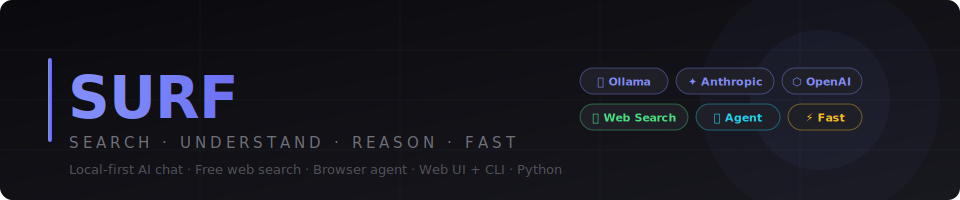
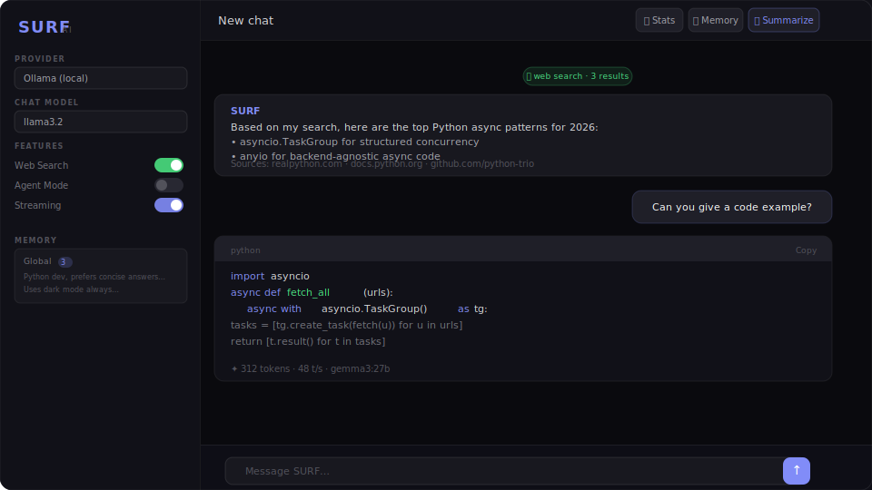
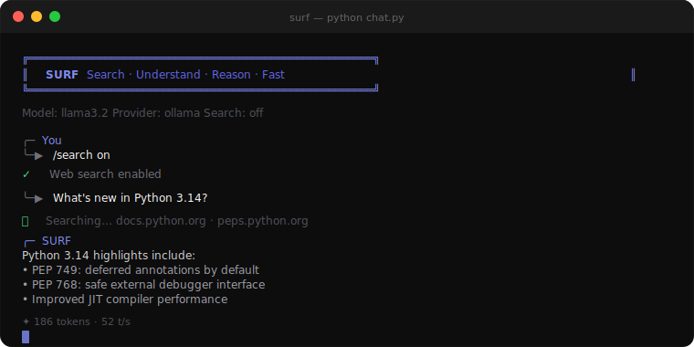

<div align="center">



<br/>

[](https://python.org)
[](https://flask.palletsprojects.com)
[](https://ollama.ai)
[](https://playwright.dev)
[](LICENSE)
[]()

<br/>

**A self-hosted AI chat with a sleek web UI and a rich terminal CLI.**  
Connect local or cloud models, search the web, automate a browser, and keep lightweight persistent memory.

</div>

---

# SURF — Search · Understand · Reason · Fast

A self-hosted AI chat with a polished web UI and CLI. SURF aims to be a practical local-first AI surface for trying models, web search, browser automation, and lightweight memory in one place.

## What is stable today

- Multi-provider chat via Ollama, Anthropic, OpenAI, OpenRouter, and compatible endpoints
- Local web UI and terminal CLI
- DuckDuckGo-based search and page fetching
- Basic browser-agent and memory features

## What is still evolving

- Test coverage and CI depth
- Runtime state/config separation
- Reliability around advanced features like browser automation and research flows

---

## Preview

<div align="center">

### Web UI


<br/>

### Terminal CLI


</div>

---

## Features

<table>
<tr>
<td width="50%">

**🦙 Any AI Provider**  
Ollama (local), Anthropic Claude, OpenAI GPT, OpenRouter, or any OpenAI-compatible endpoint. Switch mid-conversation with `/provider`.

</td>
<td width="50%">

**🔍 Free Web Search**  
DuckDuckGo search with no API key and no quota. Multi-source synthesis powered by Playwright. Works in both web UI and CLI.

</td>
</tr>
<tr>
<td>

**🤖 Browser Agent**  
Vision-powered autonomous browsing. Give a task in plain English — SURF opens a real browser, takes screenshots, and executes: click, type, scroll, navigate.

</td>
<td>

**🧠 Persistent Memory**  
Global facts survive across all conversations. Session facts are auto-extracted and deduplicated. Fully editable via sidebar or the Memory modal.

</td>
</tr>
<tr>
<td>

**📄 Conversation Summariser**  
One-click AI summary of any conversation — structured into Topic, Key Points, and Outcome. Optionally save to memory with a toggle.

</td>
<td>

**📖 Skills System**  
Drop a Markdown file into `skills/` to give SURF new capabilities. Built-in: Web Researcher and File Reader. Enable/disable per-session.

</td>
</tr>
<tr>
<td>

**📊 Analytics Dashboard**  
Track messages, token counts, tokens/sec, response times, and model usage breakdowns across every conversation — all rendered locally.

</td>
<td>

**👁 Vision & Images**  
Upload images in the web UI or attach via `/image` in the CLI. A dedicated vision model slot routes image messages automatically.

</td>
</tr>
</table>

---

## Architecture at a glance

- `core/surf.py` — main CLI runtime, provider selection, token/context helpers
- `core/web_ui.py` — Flask web interface and local state handling
- `core/ai_search.py` — DuckDuckGo search + page fetching helpers
- `core/ai_tools.py` — wrappers for use with tool-calling frameworks
- `core/browser_agent.py` — browser automation path
- `skills/` — optional markdown-driven extensions

## Runtime state

SURF now keeps local runtime state under `.surf/` by default instead of cluttering the project root.
You can override the location with `SURF_DATA_DIR=/path/to/data`.

## Quick Start

### Windows

```powershell
.\setup.ps1
```

### macOS / Linux

```bash
chmod +x setup.sh && ./setup.sh
```

### Manual setup

```bash
python -m venv venv
source venv/bin/activate          # Windows: .\venv\Scripts\Activate.ps1
pip install -r requirements.txt
playwright install chromium
```

### Run — CLI

```bash
python chat.py                              # Ollama (default, auto-starts)
python chat.py --search                     # Start with web search on
python chat.py -p anthropic                 # Anthropic Claude
python chat.py -p openai                    # OpenAI GPT
python chat.py -p openrouter                # OpenRouter
python chat.py -p custom -u http://localhost:1234/v1 -m my-model
```

### Run — Web UI

```bash
python chat.py --web                        # opens http://localhost:7777
# or from inside the CLI:
/web
```

---

## CLI Commands

Type `/` to open the interactive slash-command menu (with tab completion).

| Command | Description |
|---------|-------------|
| `/search` | Toggle web search on / off |
| `/think` | Toggle thinking-block display |
| `/stream` | Toggle live streaming |
| `/model <name>` | Switch model |
| `/models` | List available Ollama models |
| `/vision <name>` | Set a dedicated vision model (e.g. `llama3.2-vision`) |
| `/image <path>` | Attach a local image to the next message |
| `/provider <name>` | Switch provider (`ollama` / `anthropic` / `openai` / `openrouter` / `custom`) |
| `/key <provider> <key>` | Set an API key |
| `/url <base_url>` | Set a custom API base URL |
| `/summarize` | AI-generated summary of the current conversation |
| `/research <topic>` | Deep research mode — searches, reads pages, synthesises |
| `/new` | Start a new conversation |
| `/clear` | Clear conversation history |
| `/status` | Show current settings |
| `/web [port]` | Launch the web UI (default port 7777) |
| `/help` | List all commands |
| `/quit` | Exit |

---

## Web UI

Open `http://localhost:7777` after running with `--web`.

**Sidebar**
- Provider selector, chat model and vision model dropdowns
- Feature toggles: web search, thinking, streaming, agent mode, stats overlay
- Code syntax-highlight theme picker
- Global and session memory panels

**Topbar**
- 📊 **Stats** — analytics dashboard (overview, model breakdown, speed, conversation history)
- 📖 **Skills** — enable / disable skill modules
- 🧠 **Memory** — view and edit remembered facts
- 📄 **Summarize** — generate a structured AI summary of the current chat

**Chat**
- Markdown rendering with syntax-highlighted code blocks
- Image upload (camera icon) — auto-routed through the vision model if set
- Slash-command menu (type `/` in the input)
- Conversation branching — fork from any assistant message

---

## Browser Agent

Gives SURF eyes and hands. When agent mode is enabled, SURF can:

1. Open a real Chromium browser (headless)
2. Take screenshots at each step
3. Send the screenshot to your vision model (or extract structured elements for non-vision models)
4. Decide and execute actions: `navigate`, `click`, `type`, `scroll`, `wait`, `done`

Enable in the web UI sidebar or with `/agent` in the CLI.

Screenshots of each step are saved to `agent_screenshots/`.

---

## Memory

SURF maintains two memory scopes:

- **Global** — persisted in `.surf/surf_memory.json` by default, available in every conversation
- **Session** — auto-extracted during the chat, cleared when the conversation ends

Manage memories from the web sidebar, the Memory topbar button, or the `/clear` command. Facts are deduplicated automatically.

---

## Skills

Skills are Markdown files in `skills/<name>/SKILL.md` with a YAML front-matter header:

```yaml
---
name: Web Researcher
description: Search the web and synthesize information
icon: 🌐
enabled: true
---
```

Built-in skills:
| Skill | Description |
|-------|-------------|
| **Web Researcher** | Real-time search + multi-source synthesis with citations |
| **File Reader** | Read and analyse workspace files (disabled by default) |

Add a new skill by dropping a folder + `SKILL.md` into `skills/`.

---

## MCP Server

Expose SURF's search capabilities as tools for Claude Desktop or any MCP client:

```bash
python core/mcp_server.py
```

Tools: `web_search`, `fetch_webpage`, `web_research`

---

## Using as a Library

```python
from core.ai_search import search, fetch, research, news_search

results = search("Python async patterns")       # DuckDuckGo results
page    = fetch("https://docs.python.org")       # Fetch + extract page text
info    = research("what is retrieval-augmented generation")  # Search + read top pages
news    = news_search("AI updates today")        # Latest news
```

---

## API Keys

Pass via environment variable or the `/key` command:

```bash
export ANTHROPIC_API_KEY=sk-ant-...
export OPENAI_API_KEY=sk-...
export OPENROUTER_API_KEY=sk-or-...
```

Keys are stored locally in `.surf/surf_keys.json` when set with `/key`.

---

## Project Structure

```
surf/
├── chat.py                 ← Entry point
├── core/
│   ├── surf.py             ← CLI — providers, commands, Rich UI
│   ├── web_ui.py           ← Flask web server + REST/SSE API
│   ├── browser_agent.py    ← Playwright autonomous browser agent
│   ├── ai_search.py        ← DuckDuckGo search + page fetching
│   ├── ai_tools.py         ← Chat function factories (Ollama, Anthropic, OpenAI…)
│   ├── mcp_server.py       ← MCP server for Claude Desktop
│   └── quick_chat.py       ← Lightweight single-shot CLI
├── skills/
│   ├── web_researcher/     ← Web search + synthesis skill
│   └── file_reader/        ← File reading skill
├── static/
│   ├── index.html          ← Web UI (single-page app)
│   ├── css/style.css
│   └── js/app.js
├── assets/                 ← README graphics
├── agent_screenshots/      ← Browser agent step captures
├── .surf/
│   ├── surf_chats.json     ← Saved conversations
│   ├── surf_memory.json    ← Persistent memory facts
│   ├── surf_stats.json     ← Usage analytics
│   └── surf_keys.json      ← Stored API keys
```

---

## Requirements

- Python 3.10+
- Ollama for local models — [ollama.ai](https://ollama.ai)
- Chromium (installed by `playwright install chromium`) for web search and browser agent

See [requirements.txt](requirements.txt) for the full Python dependency list.

---

## License

MIT

---

<div align="center">
<sub>Built with 🖤 — local-first, no tracking, no cloud lock-in</sub>
</div>
